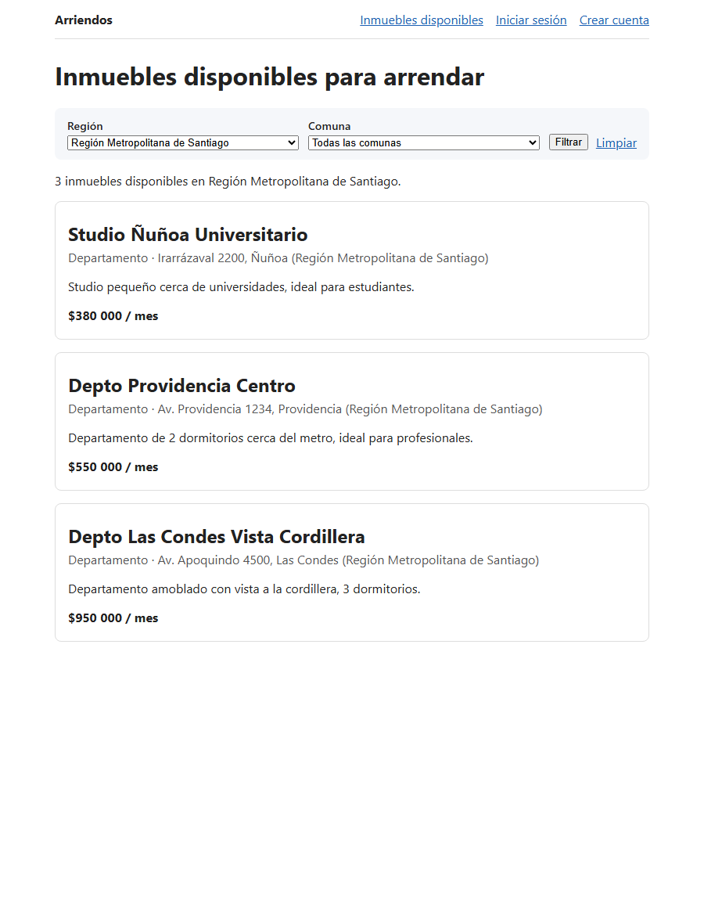
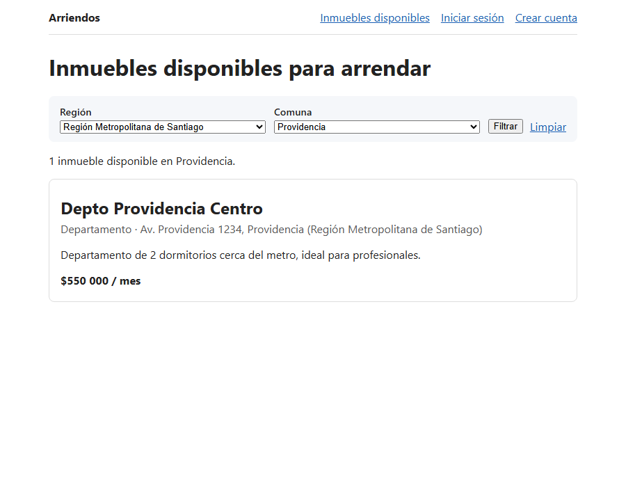
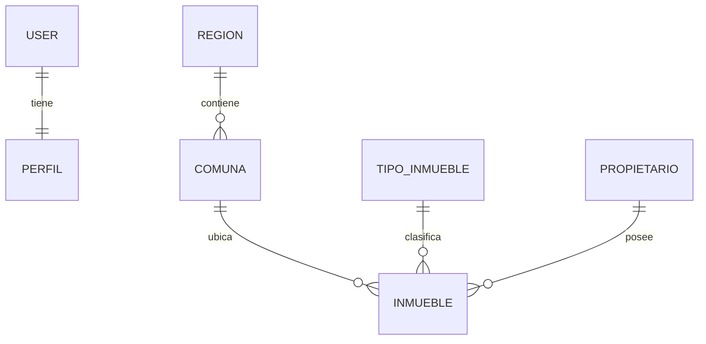

# Arriendos

Sitio web para publicar y buscar inmuebles en arriendo en Chile, con filtro por región y comuna. Tiene dos tipos de usuario, **arrendatario** y **arrendador**, cada uno con sus propias funciones. Está hecho con Django y PostgreSQL.

Proyecto del módulo *Acceso a Datos en Django* del bootcamp Full Stack Python de Talento Digital (Desafío Latam).



## Funcionalidades

**Cualquier visitante**
- Ve la oferta de inmuebles disponibles, ordenada por precio.
- Filtra por región y por comuna. Al elegir una región, el selector de comunas muestra solo las de esa región, y la URL guarda el filtro para poder compartirlo.

**Usuario registrado (ambos tipos)**
- Se registra eligiendo si es arrendatario o arrendador, inicia y cierra sesión.
- Ve y edita su perfil: nombre, apellido, correo y teléfono.

**Arrendador**
- Publica inmuebles en una comuna, con tipo, descripción, dirección y precio mensual.
- Ve sus inmuebles en un dashboard, y los edita o elimina. Un arrendador solo puede tocar sus propios inmuebles: los ajenos devuelven 404.

También incluye un panel de administración de Django configurado para los modelos principales (`/admin/`).



## Stack

- Python y Django 5.2 (LTS)
- PostgreSQL, con `psycopg2`
- `python-dotenv` para la configuración
- Plantillas de Django con HTML y CSS propios, sin frameworks externos

## Modelo de datos



| Relación | Tipo | Detalle |
|---|---|---|
| `User` → `Perfil` | uno a uno | El perfil guarda el tipo de usuario y el teléfono |
| `Region` → `Comuna` | uno a muchos | `PROTECT`: no se borra una región con comunas |
| `Comuna` → `Inmueble` | uno a muchos | `SET_NULL`: si se borra la comuna, el inmueble se conserva |
| `TipoInmueble` → `Inmueble` | uno a muchos | `SET_NULL` |
| `Propietario` → `Inmueble` | uno a muchos | `PROTECT`: evita borrar inmuebles en cascada |

El precio es un `DecimalField` y no un `FloatField`, porque se trata de dinero.

## Instalación

Requisitos: Python (desarrollado y probado con 3.14), PostgreSQL y git.

1. Clonar el repositorio y crear el entorno virtual:

   ```bash
   git clone https://github.com/sebastianmella1625-dev/arriendos-django.git
   cd arriendos-django
   python -m venv .venv
   source .venv/bin/activate        # En Windows: .venv\Scripts\activate
   pip install -r requirements.txt
   ```

2. Crear la base de datos y un usuario propio para la aplicación (no se usa el superusuario `postgres`):

   ```sql
   CREATE ROLE arriendos_user WITH LOGIN PASSWORD 'elige-una-contraseña';
   CREATE DATABASE arriendos_db OWNER arriendos_user;
   ```

3. Configurar las variables de entorno. Copia la plantilla y complétala:

   ```bash
   cp .env.example .env
   python -c "from django.core.management.utils import get_random_secret_key as g; print(g())"
   ```

   Pega la clave generada en `SECRET_KEY` y completa los datos `DB_*`. El archivo `.env` está en el `.gitignore` y no se sube al repositorio.

4. Crear las tablas y cargar los datos de ejemplo (16 regiones, 346 comunas, tipos, propietarios, inmuebles y usuarios de prueba):

   ```bash
   python manage.py migrate
   python manage.py loaddata regiones comunas tipos_inmueble propietarios inmuebles usuarios
   ```

5. Crear un superusuario para el panel de administración y ejecutar el servidor:

   ```bash
   python manage.py createsuperuser
   python manage.py runserver
   ```

   El sitio queda en <http://127.0.0.1:8000/>.

### Probar con usuarios de ejemplo

Los usuarios `arrendatario1`, `arrendatario2` y `arrendatario3` de los datos de ejemplo se cargan **sin contraseña utilizable**. Para entrar con alguno, asígnale una:

```bash
python manage.py changepassword arrendatario1
```

Para probar como **arrendador**, regístrate en `/accounts/registro/` eligiendo ese tipo y usando el correo de uno de los propietarios de ejemplo (por ejemplo `maria.gonzalez@example.com`). Los inmuebles se asocian al usuario por ese correo, así que verás los de esa propietaria en tu dashboard.

## Rutas principales

| Ruta | Descripción | Acceso |
|---|---|---|
| `/inmuebles/` | Oferta con filtro por región y comuna | Público |
| `/accounts/registro/` | Registro de usuario | Público |
| `/accounts/login/` | Inicio de sesión | Público |
| `/accounts/perfil/` | Perfil del usuario | Con sesión |
| `/accounts/perfil/editar/` | Editar datos personales | Con sesión |
| `/inmuebles/mios/` | Mis inmuebles | Arrendador |
| `/inmuebles/nuevo/` | Publicar inmueble | Arrendador |
| `/inmuebles/<id>/editar/` | Editar inmueble | Arrendador, solo los suyos |
| `/inmuebles/<id>/eliminar/` | Eliminar inmueble | Arrendador, solo los suyos |
| `/admin/` | Panel de administración | Staff |

## Estructura

```
arriendos-django/
├── arriendos/            # Configuración del proyecto (settings, urls)
├── propiedades/          # App principal
│   ├── models.py         # Modelos de datos
│   ├── forms.py          # Formularios (registro, inmuebles, filtro)
│   ├── views.py          # Vistas
│   ├── urls.py
│   ├── admin.py          # Configuración del admin
│   ├── migrations/
│   └── fixtures/         # Datos de ejemplo
├── templates/            # Plantilla base y vistas de autenticación
├── generar_reportes.py   # Reportes de inmuebles por comuna y por región
├── .env.example          # Plantilla de variables de entorno
└── requirements.txt
```

## Reportes

`generar_reportes.py` lista los inmuebles disponibles agrupados por comuna y por región. Cada resultado se obtiene con el ORM de Django y se contrasta con una consulta SQL directa. Escribe los archivos `reporte_por_comuna.txt` y `reporte_por_region.txt`:

```bash
python generar_reportes.py
```

## Decisiones de diseño

- **Configuración fuera del código:** la clave secreta, el modo debug y las credenciales de la base de datos se leen del entorno. Si falta `SECRET_KEY`, la aplicación se detiene con un mensaje claro en lugar de usar una clave por defecto.
- **Permisos por consulta:** las vistas de edición y eliminación buscan el inmueble dentro de los del usuario. Así, intentar abrir uno ajeno da 404 y no hay que comprobar permisos aparte.
- **Registro atómico:** el usuario y su perfil se crean en una misma transacción, para que no quede un usuario sin perfil.
- **Filtro por GET:** filtrar no modifica datos, y con GET el resultado se puede compartir por URL. Los valores inválidos se ignoran y no rompen la página.
- **Consultas con `select_related`:** los listados traen la comuna, la región y el tipo en una sola consulta.

## Limitaciones y próximos pasos

- El vínculo entre el usuario arrendador y su propietario se hace por correo electrónico, porque `Propietario` no está ligado a `User`. Una relación directa sería más robusta.
- Falta lo que pedía el enunciado general del proyecto y quedó fuera de los hitos: RUT y dirección del usuario, metros cuadrados, estacionamientos, habitaciones y baños del inmueble, solicitud de arriendo y aceptación de arrendatarios.
- Faltan pruebas automatizadas (`propiedades/tests.py` está vacío).

## Autor

[sebastianmella1625-dev](https://github.com/sebastianmella1625-dev)
